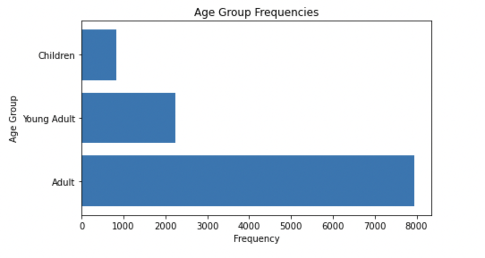
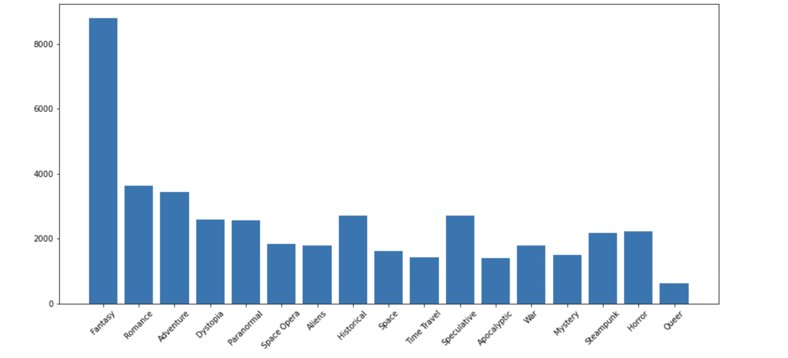
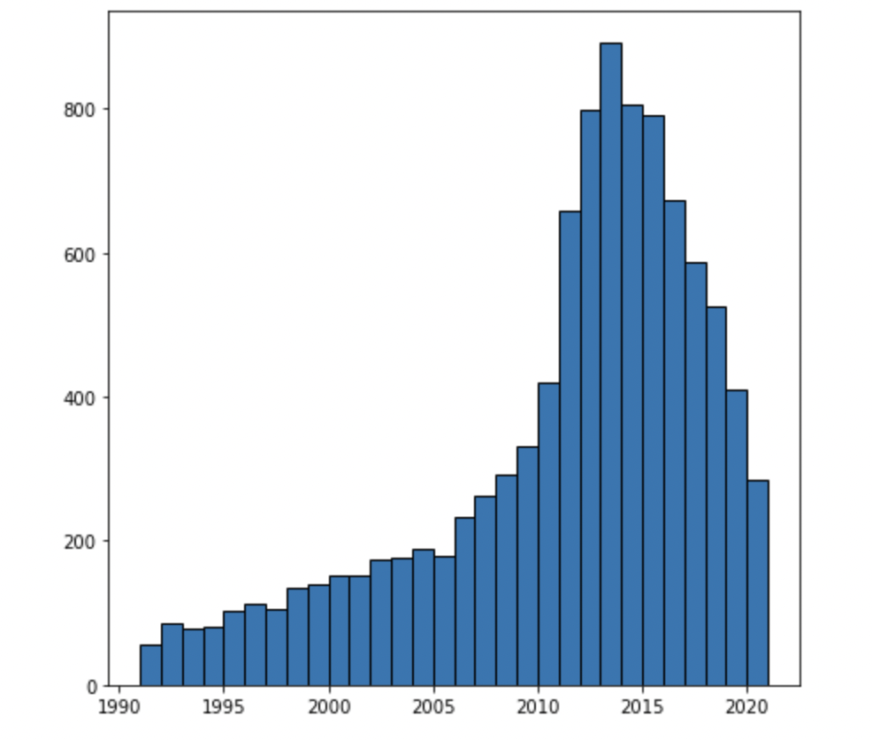
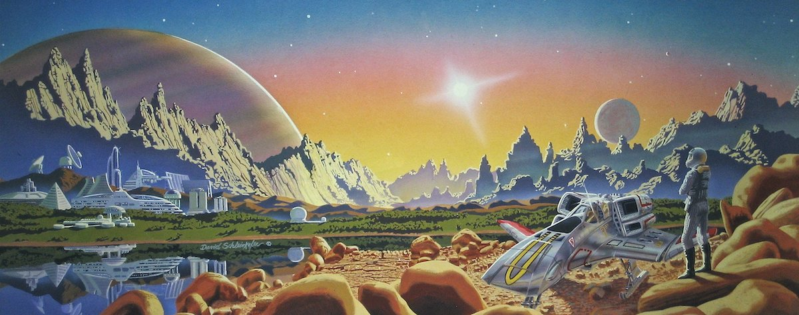
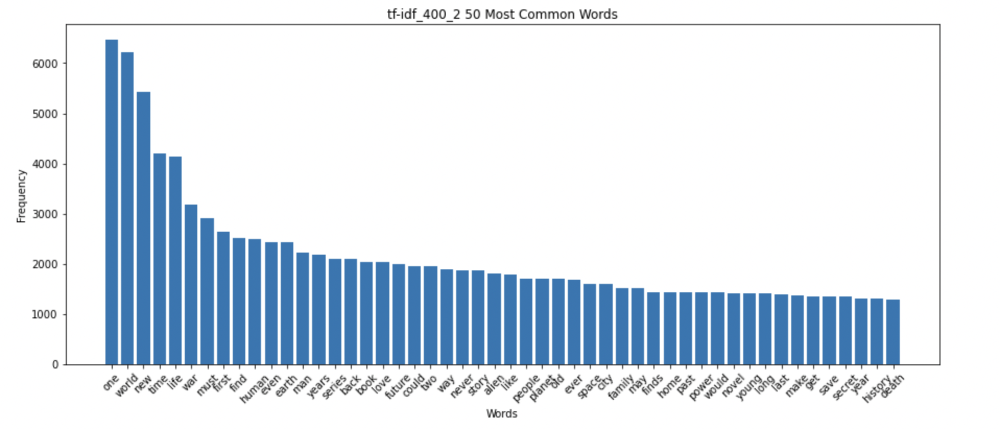
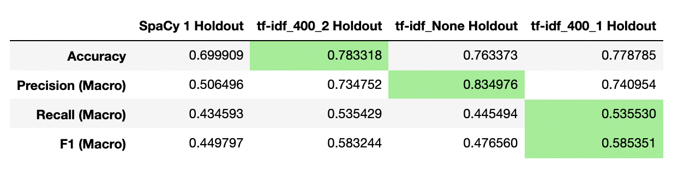
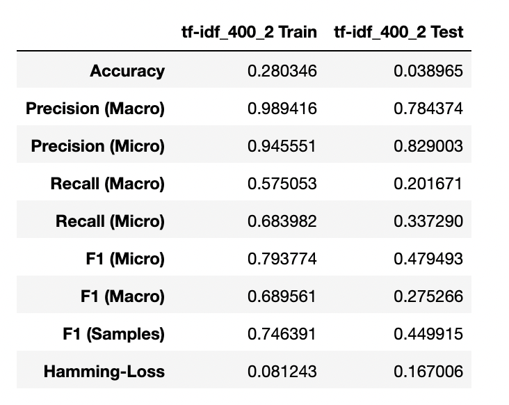

# Identifying Science Fiction Sub Genres and Book Recommendations
### Andrew Mooney

## Objective

This project is for all you writers out there. As someone who has tried (unsuccessfully) to acquire a literary agent, I have learned a great deal about how important industry knowledge is to new authors looking to get published. Using a dataset of 11000 science fiction books and Natural Language Processing, I built a tool that takes in a book blurb and then predicts its Science Fiction subgenre, its intended age demographic, and also provides the top ten similar science fiction novels. The ultimate goal is to publish this as a free tool to help neophyte authors to shift from writing as a hobby to writing as a profession.

## The Data
I used the [Science Fiction Books Kaggle dataset](https://www.kaggle.com/tanguypledel/science-fiction-books-subgenres) which has around 11k unique rows detailing the novel's title, author, year of publication, Goodread scores and, crucially, its book description. Book descriptions are a good target for NLP analysis because they have typically been edited and tested by marketing professionals based on industry trends. Therefore, there is much less noise than in, say, a series of tweets. They contain full sentences, correct syntax, and common themes.

I determined the appropriate subgenres and age categories by using the Goodreads user tags. There are two major models at the core of this project, one *multi-class* classification model that predicts age categories and one *multi-label* classification model that predicts genres.

Here is a frequency distribution of the Age Categories in the dataset:

And here is the frequency distribution of sub-genres based on user tags:

The dataset also contains books from several centuries, though the majority of the books included were published in the last 30 years. Here is the year distribution for the books published after 1990:

## Natural Language Processing Method
In order to vectorize each book description, I used a combination of methods and tested them against one another including Term Frequency-Inverse Document Frequency (TF-IDF), Count Vectorization and the word embedding library used in SpaCy.

### Vectorization Method
Ultimately, the method that produced the strongest overall metric scores was TF-IDF Vectorization after the removal of Stop Words and after using SpaCy's lemmatization pipeline method. Here is the word cloud of the preprocessed corpus:

And here is the frequency distribution of the major words:

## Models

As mentioned above, this project has two models at its core. 

### Model 1 - Age Group - Multi-Class

The first model identifies the target demographic for the book. This is a multi-class model, which means each category is distinct and each novel can only belong to one of the three categories. I tested multiple vectorization methods on Support Vector Machines to achieve a score of 78% accuracy when predicting the age category of a novel description. Here are the final scores of each vectorization method:

### Model 2 - Sub-Genre - Multi-Label

The second model identifies the many possible sub-genres the novel could belong to. These are not distinct categories, so, in theory, a novel could belong to all 15 sub-genres. To measure the accuracy of this model I used a blend of macro and micro scores. Overall accuracy was determined by minimizing the Hamming Loss score, which measures the accuracy of each individual label. My final model had a Hamming loss of .167 on the Holdout dataset using a Random Forest classifier

## Conclusions

In the words of George E. P. Box, "all models are wrong, but some are useful." and that is extremely true in this case. The Age Model beat the base line accuracy scores by about 8%, but the overall accuracy of the Genre model is quite low. That said, by looking at the probabilities of each sub-genre, we can rank which genres are most likely. We can also see which words were most important to the overall score.

Using this information, authors can refine their book descriptions by using specific words to increase certain genre scores. Also, by vectorizing each book description, we can use cosine similarity to identify the top 10 most similar novels. These tools could be invaluable to helping new authors source possible agents for books that are similar in theme and style to their own work. In addition, they can use the genre scores as a way of refining their current book description to fit more in line with the ideal subgenres and age demographics.

## Next Steps

The core dataset is comprised only of Science Fiction books, but, with more data from other genres, we could build different models for each major publishing genre as well as expand our similarity database to further aid authors in exploring other agents.

Beyond that, this same methodology could be used to try to predict a novel's success based on its description, though that would require book sales data. This data definitely exists, but because it is so valuable to the publishing industry, it is supremely expensive.

Lastly, this data does not include one crucial column: Agents. If we enriched the data with the agents who represent the books, we can start to see patterns in agent tastes and preferences. Again, finding that data can be a challenge/expensive, but it would increase the value of this tool immeasurably.

I plan to continue working on this model by expanding the number of genres as well as the size of the overall dataset. If I can fold in direct agent information to create new insights, that would be the ultimate goal.

## Resources:
### Writing Resources
- [How to Write a Query Letter](https://www.janefriedman.com/query-letters/)
- [Determing Sci-Fi Sub-Genres](https://writersrelief.com/2011/07/11/determine-book-genre/)
- [Writing a Science Fiction Cover Letter](https://writersrelief.com/2018/05/31/query-letter-genre-essentials-pitching-sci-fi-and-fantasy-novels-writers-relief/)

### NLP Resources
- [How SpaCy Words](https://spacy.io/usage/spacy-101)
- [TF-IDF Vectorization - Towards Data Science Blog](https://towardsdatascience.com/text-vectorization-term-frequency-inverse-document-frequency-tfidf-5a3f9604da6d)
- [Skip-Grams - Towards Data Science Blog](https://towardsdatascience.com/skip-gram-nlp-context-words-prediction-algorithm-5bbf34f84e0c)
- [SpaCy Lemmatizer Documentation](https://spacy.io/api/lemmatizer)
- [Multi-Label Classification Metrics - Towards Data Science Blog](https://towardsdatascience.com/journey-to-the-center-of-multi-label-classification-384c40229bff)
